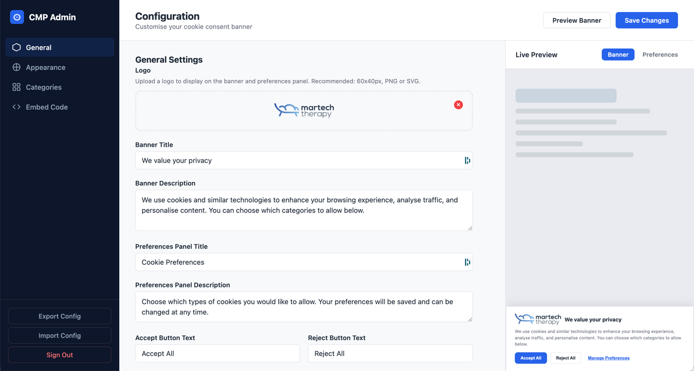
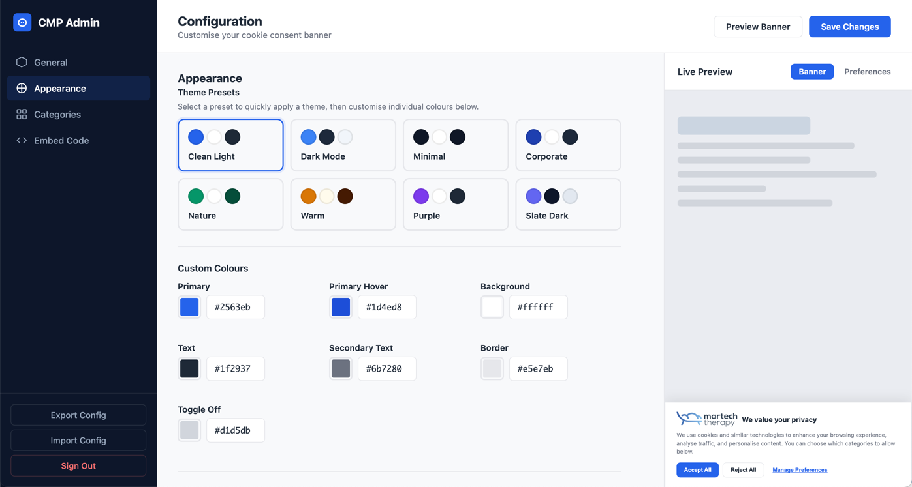
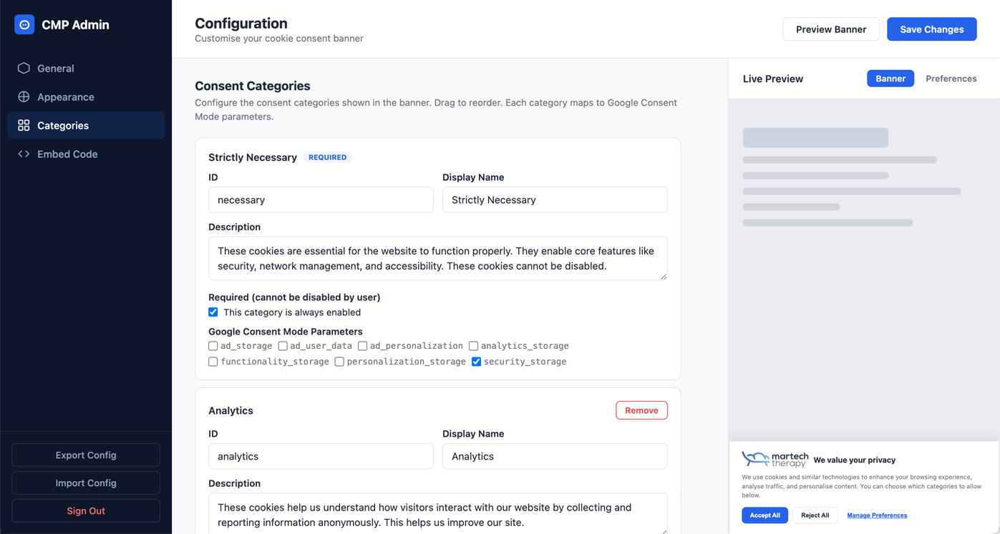
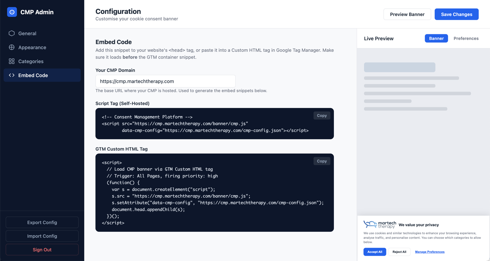
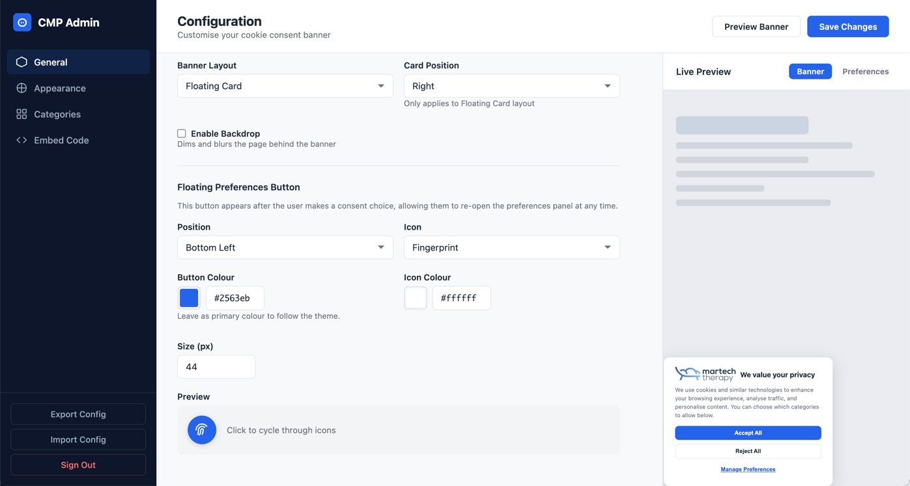

# Consent Management Platform (CMP)

A self-hosted, open-source Consent Management Platform with an injectable cookie banner and full **Google Consent Mode v2** support. Collect and manage cookie consent in compliance with GDPR and ePrivacy regulations while integrating seamlessly with Google Tag Manager and Google Analytics.

**Zero dependencies. Vanilla JS. Works on any website.**

## Screenshots

| General Settings | Appearance & Themes |
|:---:|:---:|
|  |  |

| Consent Categories | Embed Code |
|:---:|:---:|
|  |  |

| Floating Card Layout |
|:---:|
|  |

## Features

- **Injectable cookie banner** — embed on any site with a single `<script>` tag
- **Google Consent Mode v2** — manages all 7 GCM parameters (`ad_storage`, `ad_user_data`, `ad_personalization`, `analytics_storage`, `functionality_storage`, `personalization_storage`, `security_storage`)
- **Admin dashboard** — configure banner text, categories, theme, and layout through a visual UI
- **Multiple layouts** — full-width bar or floating card, with optional backdrop blur
- **Theme presets** — 8 built-in themes (light, dark, minimal, corporate, nature, warm, purple, slate dark) plus full colour customisation
- **Preferences panel** — users can granularly control consent per category
- **Floating re-open button** — configurable icon, position, and colour
- **Logo support** — upload a logo for the banner and preferences panel
- **Config-driven** — all behaviour controlled via a single JSON config file
- **No dependencies** — the dev server uses only Node.js built-in modules; the banner script is a self-contained IIFE

## Quick Start

```bash
# Clone the repository
git clone https://github.com/tagticians/consent-management-platform.git
cd consent-management-platform

# Start the dev server
npm run dev
```

Open [http://localhost:3000](http://localhost:3000) in your browser.

| URL | Description |
|-----|-------------|
| `http://localhost:3000/` | Test page with diagnostics |
| `http://localhost:3000/admin` | Admin dashboard |
| `http://localhost:3000/banner/cmp.js` | Banner script |
| `http://localhost:3000/cmp-config.json` | Configuration file |

## Embedding on Your Website

Add this snippet to your site's `<head>`, **before** the GTM container snippet:

```html
<script src="https://YOUR-DOMAIN.com/banner/cmp.js"
        data-cmp-config="https://YOUR-DOMAIN.com/cmp-config.json"></script>
```

Or use an inline config:

```html
<script>window.CMP_CONFIG = { /* your config */ };</script>
<script src="https://YOUR-DOMAIN.com/banner/cmp.js"></script>
```

## Configuration

All banner behaviour is controlled by `cmp-config.json`. You can edit it directly or use the admin dashboard.

### Banner Options

| Field | Type | Default | Description |
|-------|------|---------|-------------|
| `position` | `"top"` \| `"bottom"` | `"bottom"` | Vertical position of the banner |
| `layout` | `"bar"` \| `"card"` | `"bar"` | Full-width bar or floating card |
| `cardPosition` | `"left"` \| `"right"` | `"right"` | Horizontal position (card layout only) |
| `backdrop` | `boolean` | `false` | Dim and blur the page behind the banner |
| `title` | `string` | `"We value your privacy"` | Banner heading |
| `description` | `string` | — | Banner body text |

### Consent Categories

Each category maps to one or more Google Consent Mode parameters:

```json
{
  "id": "analytics",
  "name": "Analytics",
  "description": "Help us understand how visitors use our website.",
  "required": false,
  "gcmParameters": ["analytics_storage"]
}
```

### Theme

Customise colours, fonts, and border radius under `banner.theme`. See the admin dashboard for a visual editor.

## Admin Dashboard

The admin panel at `/admin` provides:

- Visual theme editor with preset themes
- Banner text and button customisation
- Layout and positioning controls
- Category management with GCM parameter mapping
- Live preview of banner and preferences panel
- Config export/import
- Embed code snippets

### Authentication

Set the `ADMIN_PASSWORD` environment variable to protect the admin panel:

```bash
ADMIN_PASSWORD=your-secret-password npm run dev
```

When set, the admin panel requires a password to access. Without it, the admin is open (suitable for local development).

## Google Consent Mode v2

The banner automatically pushes `consent` commands to `window.dataLayer`:

1. On page load: pushes `consent('default', ...)` with all parameters set to `denied`
2. When the user makes a choice: pushes `consent('update', ...)` with granted/denied per category
3. Also fires a `cmp_consent_update` dataLayer event with the full consent state

This is compatible with GTM's built-in consent mode triggers.

## JavaScript API

After the banner loads, a global `window.CMP` object is available:

```javascript
// Get current consent state
CMP.getConsent();
// → { necessary: true, analytics: true, marketing: false, ... }

// Get GCM parameter state
CMP.getGcmState();
// → { ad_storage: 'denied', analytics_storage: 'granted', ... }

// Listen for consent changes
CMP.onConsentChange(function(state) {
  console.log('Consent updated:', state);
});

// Reset consent (clears cookie, re-shows banner)
CMP.resetConsent();

// Programmatically open preferences
CMP.showPreferences();
```

## Project Structure

```
├── server.js              # Node.js HTTP dev server (zero dependencies)
├── cmp-config.json        # Central configuration file
├── package.json           # Project metadata
├── banner/
│   └── cmp.js             # Injectable cookie banner script (vanilla JS IIFE)
├── admin/
│   ├── index.html         # Admin dashboard UI
│   ├── admin.css          # Admin styles
│   └── admin.js           # Admin logic
└── test-page/
    └── index.html         # Test page with consent diagnostics
```

## Browser Support

The banner script (`banner/cmp.js`) uses ES5 syntax for maximum browser compatibility. It works in all modern browsers and IE11+.

## License

MIT
